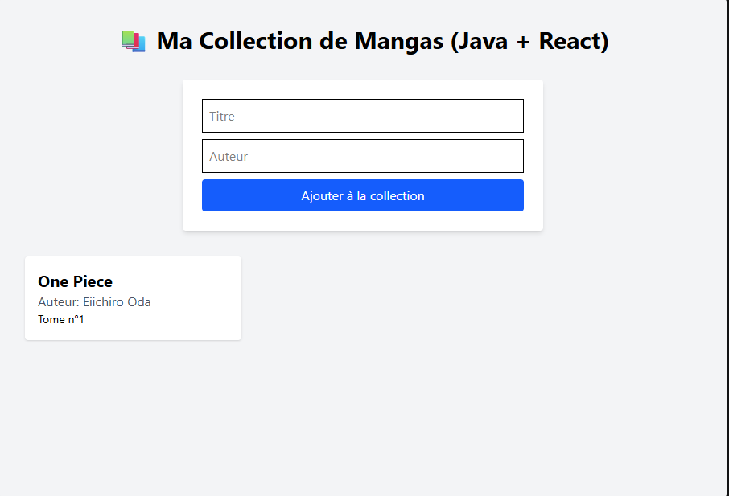

# 📚 Manga Collection — Fullstack App (Java / React)

Application Web **Fullstack** moderne permettant de gérer une bibliothèque personnelle de mangas. Ce projet met en œuvre une architecture découplée avec un puissant Back-end en **Java (Spring Boot)** et un Front-end dynamique en **React**.

---

## 📷 Aperçu du Projet


*(Note : Pense à placer ta capture d'écran dans tes dossiers et à ajuster ce chemin d'image pour qu'elle s'affiche sur GitHub !)*

---

## 🚀 Fonctionnalités
* **Architecture découplée** : Séparation stricte entre l'API et l'interface utilisateur.
* **Opérations CRUD** : Ajout dynamique de nouveaux volumes à la collection.
* **Persistance des données** : Base de données relationnelle avec génération automatique des tables via ORM.
* **Interface Responsive** : Design épuré et moderne adapté à tous les écrans.

---

## 🛠️ Stack Technique

### Back-end
* **Langage** : Java
* **Framework** : Spring Boot (v3+)
* **Accès aux données** : Spring Data JPA / Hibernate
* **Gestionnaire de dépendances** : Maven

### Front-end
* **Framework** : React.js (Vite)
* **Styles** : Tailwind CSS (v4)
* **Requêtes HTTP** : Axios

### Base de données
* **SGBD** : MySQL / MariaDB (via XAMPP)

---

## ⚙️ Installation et Démarrage

### 1. Prérequis
* **Java JDK** (version 17 ou 21)
* **Node.js** & npm
* **XAMPP** (ou un serveur MySQL local lancé)

### 2. Lancer le Back-end (Spring Boot)
1. Ouvrez le dossier `manga-collection` dans votre IDE.
2. Assurez-vous que votre module MySQL est actif sur XAMPP.
3. Configurez vos accès dans `src/main/resources/application.properties` si nécessaire.
4. Lancez l'application via votre IDE ou avec la commande suivante :
   ```bash
   ./mvnw spring-boot:run
